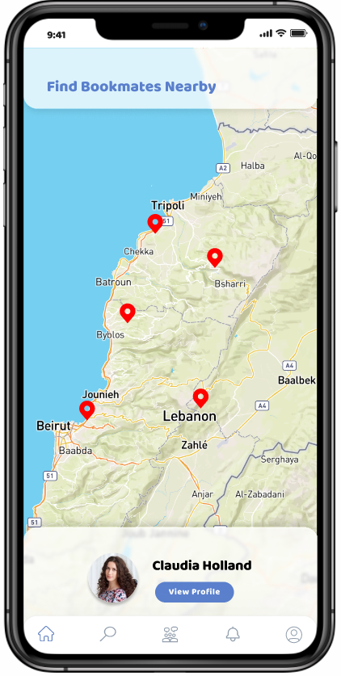
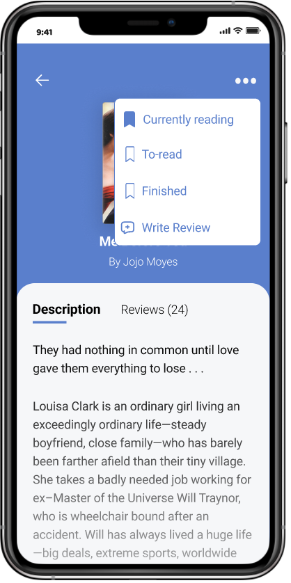

<div align="center">

> Bookmates is a mobile application meant to bring you closer to book lovers around you.

**[PROJECT PHILOSOPHY](#philosophy) • [WIREFRAMES](#wireframes) • [TECH STACK](#tech) • [IMPLEMENTATION](#implementation) • [HOW TO RUN?](#install)**

</div>

<br><br>


> Ever finished a really good book, but found no one to discuss it with?
> Bookmates' main vision is to connect you to readers around you who have similar interests. 
- You can check out other bookmates' bookshelves, see what books they have read, are currently reading, or have on their to-read list. 
- Add books you like to your own bookshelf, or get other suggestions using the search functionality with a library of over 10 million books!
- You can also post reviews on books you've finished reading, interact with your bookmates, and share different perspectives.
#### Today's stranger could become tomorrow's reading pal!

### User Stories
- As a user, I want to view bookmates profiles on a map based on their locations
- As a user, I want to visit bookmates' profiles and check out their bookshelves
- As a user, I want to follow/unfollow bookmates
- As a user, I want to search for books to add to my own bookshelf
- As a user, I want to customize my profile (name, profile picture, bio)
- As a user, I want to view a feed that shows the reviews of bookmates that I follow, and interact with them (like, dislike, comment)
- As a user, I want to post my own reviews on books that I've read

<br><br>


> This design was planned before on paper, then moved to Figma app for the fine details.

<table>
  <tr>
    <td></td>
    <td></td>
    <td></td>
  </tr>
  <tr>
    <td></td>
    <td></td>
    <td></td>
  </tr>
</table>

<br><br>


Here's a brief high-level overview of the tech stack the Bookmates app uses:

- Frontend: this project uses the [React Native framework](https://reactnative.dev/). React Native is used to develop applications for Android, Android TV, iOS, macOS, tvOS, Web, Windows and UWP by enabling developers to use the React framework along with native platform capabilities. For the development environment, [Expo CLI](https://reactnative.dev/docs/environment-setup) was used.
- Backend: this project uses [Node.js](https://reactnative.dev/) and [Express](https://expressjs.com/). Node.js is a cross-platform, JavaScript runtime environment - it representing a "JavaScript everywhere" paradigm, by unifying web-application development around a single programming language, rather than different languages for server-side and client-side scripts. Express is a minimal and flexible Node.js web application framework that provides a robust set of features for web and mobile applications.
- For persistent storage (database), the app uses [MongoDB](https://www.mongodb.com/).
- The app uses the fonts [Roboto](https://fonts.google.com/specimen/Roboto) and [Baloo-2](https://fonts.google.com/specimen/Baloo+2) as its main fonts, and the design of the app adheres to the material design guidelines.
- [Google Maps API](https://developers.google.com/maps) is used to display users on a map based on their locations.
- [Google Books API](https://developers.google.com/books) is used to search books and display their data (title, author, thumbnail, isbn, description).

<br><br>


> Using the above mentioned tech stack and the wireframes built with Figma, the implementation of the app is shown as below (screenshots from the real app)

<table>
  <tr>
    <td></td>
    <td></td>
    <td></td>
    <td></td>
  </tr>
  <tr>
    <td></td>
    <td></td>
    <td></td>
    <td></td>
  </tr>
</table>

<br><br>


> To get a local copy up and running follow these simple steps.

### Prerequisites

* Download and install [Node.js](https://nodejs.org/en/)

* npm
  ```sh
  npm install npm@latest -g
  ```
* Expo CLI
  ```sh
  npm install --global expo-cli
  ```
* Expo Go app for iOS and Android  

  > 🤖 [Android Play Store](https://play.google.com/store/apps/details?id=host.exp.exponent) - Android Lollipop (5) and greater.  
  > 🍎 [iOS App Store](https://apps.apple.com/app/expo-go/id982107779) - iOS 11 and greater.
 

### Installation

1. Clone the repo
   ```sh
   git clone https://github.com/laurena-fayad/bookmates-app.git
   ```
2. Navigate to the Frontend folder and install dependencies
   ```sh
   cd bookmates-app/Frontend
   npm install
   ```
3. Run the start up command
   ```sh
   expo start
   ```
4. Scan the generated QR code with your camera (ios) or through the Expo Go application (android)
